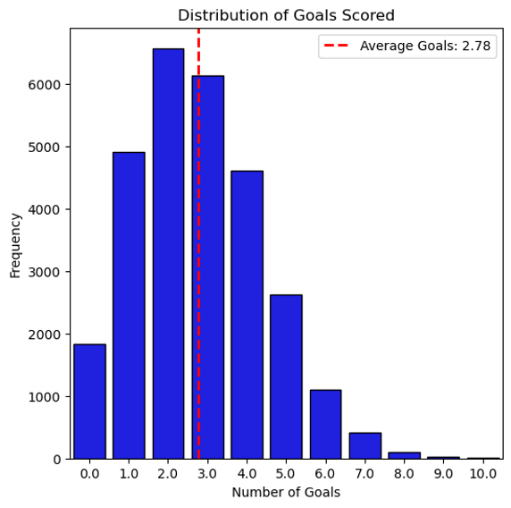
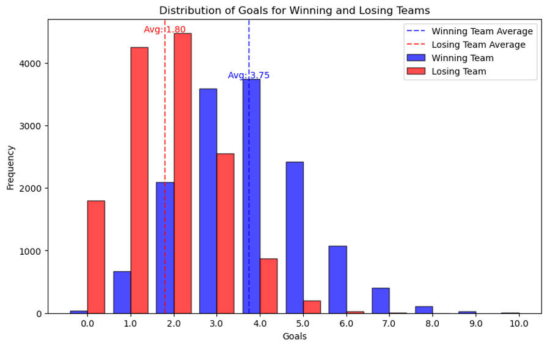
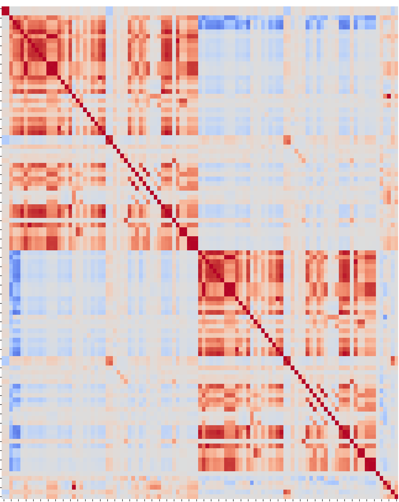

#  NHL Game Prediction Project

 

## Project Introduction

This project will seek to build a model to effectively predict the outcome of National Hockey League games.

## Table of Contents

- [Motivation](#motivation)
- [Dataset](#dataset)
- [Roadmap](#roadmap)
- [Learnings](#learnings)

## Motivation

As an avid hockey fan, I have always been interested in the factors that are most important in determining the outcome of games. With the recent rise in statistical analysis of hockey players and games via Advanced Statistics, we have access to more useful data than ever. Nevertheless, the randomness and fluidity of hockey makes it notoriously difficult to accurately predict outcomes, with [62% accuracy](https://www.google.com/url?sa=t&rct=j&q=&esrc=s&source=web&cd=&cad=rja&uact=8&ved=2ahUKEwi39_L8vYOCAxVfODQIHcFnCJoQFnoECA4QAQ&url=https%3A%2F%2Fis.muni.cz%2Fth%2Froec4%2FAnalysis_of_NHL_games_Archive.pdf&usg=AOvVaw130WCcVDzGxZQHy_fbhI9c&opi=89978449) being [commonly held](https://www.researchgate.net/publication/284457066_Predicting_NHL_Match_Outcomes_with_ML_Models) as the upper limit of most models.

The purpose of this exercise is to test those limits, while gaining a deeper understanding of the variables that influence game outcomes. Success in this area would be of interest to general hockey fans, hockey journalists and content creators, and professional team management (general managers, coaches), not to mention the sports betting community!

## Dataset

I have sourced two datasets to provide the information that I want, and merged them into a single one for analysis. The first dataset comes from [Moneypuck.com](moneypuck.com). It contains ~190k rows of Advanced Stats for all NHL games from the 2008-09 season to the 2022-23 season, aggregated at a team level. The second dataset contains ~52k rows of basic statistics for each game from the 2000-01 season to the 2019-20 season, published by the NHL itself (although downloaded from Kaggle). 

I was tempted to exclude the second dataset, as the first dataset is more current and contains almost all of the same columns of data, albeit with different names. However, the first dataset does not have a column that states whether the team won or lost, which is the dependent variable I will be attempting to predict. I could conceivably subtract 'goals against' from 'goals for' in the first dataset, and create a binary variable for win or loss based on whether that calculation was positive or negative, but it turns out that the Moneypuck dataset, while at the team level, is the aggregation of individual player stats. This is really only problematic when determining the outcome of games decided in a shootout, as the the team that wins is credited with a winning goal, but no individual player is credited with a goal. Based on that, subtracting 'goals against' from 'goals for' in the Moneypuck dataset sometimes gives a result of 0, which would not allow me to determine the game winner from that dataset alone. As a result, I have included both datasets. I still hope to update all the data through the end of the 2022-23 season.

The initial data dictionary can be found [here](Notebooks/Data_Dictionary.ipynb). 

## Roadmap

### Data Merging
I started by merging the two datasets. Both included the game ID, but each game ID had two records, one for each team that played in that game. As a result, it was not a sufficient key on which to join the datasets. Both datasets had a form of team ID that could also be used, but one was in the form of a three-letter team abbreviation, while the other was a numerical team ID. Fortunately, the source of that data also provided an additional file with team information, including the three-letter abbreviation, so I had all the information I needed.

Or so I thought. I realized through several iterations that there were subtle differences between the team IDs. In one case, one used periods for names with initial while the other used three letters. For example, the New Jersey Devils were referred to as 'N.J' in one dataset, but 'NJD' in the other. Similarly, a couple of teams changed abbreviations during the seasons spanned, and the datasets treated the name changes differently. The Atlanta Thrashers (ATL) became the Winnipeg Jets (WPG) and the Phoenix Coyotes (PHX) became the Arizona Coyotes (ARI). One dataset included the changes while the other made the changes retroactive, meaning there were inconsistencies.

Despite the challenges, I was able to merge the two datasets, resulting in a single dataset with ~28k rows and 127 columns.

### Data Cleaning
Cleaning the merged dataset largely consisted of removing columns with duplicate information, along with the rows/seasons that the two datasets did not have in common. There were also some duplicate rows in one of the datasets, which appeared to be the result of human error in creating the dataset originally. I also chose to remove playoff games from the dataset, as it is a commonly-held belief that the regular season is not an accurate predictor of playoff outcome, and vice versa. Finally, I converted all of the important non-numeric columns to numeric, to enable me to run correlation analysis and regression, for example.

### Exploratory Data Analysis (EDA)
Initial EDA focused on overall average performance of teams along multiple dimensions, including wins and goals scored. I idenfied the variables with the highest positive and negative correlation with wins (not surprisingly, goals scored and goals allowed were at the top of each list). I also looked at some of the differences that were visible when filtering by the categories in the two major categorical variables: win/loss and home/away. For more information, see the [Learnings](#learnings) section below. 

### Feature Selection / Feature Engineering
With over 100 independent variables, some of which are built from the same underlying data, it will be crucial to identify and isolate those that prove most important in predicting game outcome. This will involve gaining a deeper understanding of the different Advanced Stats in common use, their similarities and differences, and their ability to predict wins and losses. In addition, I have a number hypotheses I would like to test that would involve the creation or addition of other variables.
- Home teams win more frequently than visiting teams, but does that vary based on length of road trip (number of games) or distance traveled? I could potentially calculate the distance between cities where teams play and include that distance as a variable. Similarly, I could count the number of consecutive away games to see if there is any change in expected outcome depending on number of away games played in a row.
- It is widely believed that when a team has to play games on back-to-back days, their chance of winning is decreased for the second game. I could calculate the number of days since the last game and analyze whether this is truly a factor.
- While I have chosen to focus on team stats rather than individual player stats, there is one area where I would consider an exception: goaltenders. The quality of goaltender is likely to have a very high impact on the outcome of the game, in particular whether the team played their starter or their backup. If possible, I will consider adding goaltender stats to the analysis.
- While I do not want to aggregate individual player statistics, it may be possible to include some kind of team strength factor based on salary cap hit. Each team is limited in how much they can spend on player salaries, with the upper bound being the salary cap, but they do not need to spend to the cap. It may be that teams that spend more have better players, and therefore an advantage. In addition, if I can get salary cap data on a game-by-game basis (a big 'if'), it could help account for situations where a team's start player or players is injured and cannot play, as the salary total for that game would be lower than if the highly-paid player was playing.
- There are some cases where I would most likely want to calculate a derived value rather than using the values that are in the dataset. For example, I have data on powerplay opportunities and powerplay goals, but I would like those consolidated into a single powerplay percentage value. The same holds for saves vs. goals against, i.e., save percentage. There may be other similar metrics that I want to derive, so I will need to plan for that.
- While much of this data will be helpful in identifying key drivers of game outcomes, how well that can be used to predict future outcomes is unclear. Forecasting single-game performance based on an average of 10+ years of data seems optimistic. It may make sense to build time series data of the last n games to see if there are short-term trends that help predict outcomes.

### Modeling
Modeling will include Logistic Regression and Machine Learning models.

## Learnings
This section will be updated as the project progresses, but here are some initial findings from EDA.
#### Home-ice Advantage

The home team wins close to 55% of the time. Given that the upper limit of the most successful prediction models is ~62%, there is a narrow window for achieving success of this project!

#### Goals

On average, teams score 2.78 goals, with goals totals fairly normally distributed.

Winning teams score 3.75 goals on average, versus 1.80 for losing teams. The average margin of victory is close to two goals.

#### Correlation with Wins

Not surprisingly, goals scored appears to be the biggest driver of wins. Subsets of goals scored also appear on the list. Perhaps more interestingly, xGoals (Expected Goals) appears frequently on the list. xGoals is an advanced stat calculated based on a formula looking at the scoring chances that teams get in a game. In particular, the xGoalsPercentage, which is a ratio of xGoals to opposing team xGoals is high on the list. These are primarily offensive stats, with defensive stats not being as correlated with wins.

Again not surprisingly, goals against is the highest driver of losses. Many of these are mirror images of the entries in the positive correlation graph, applying the same stats to the opposing team, but there are some differences. For instance, lowDangerShotsFor is an offensive category for the team we are analyzing for their likelihood of winning. It appears that if a team takes a lot of shots, but they are low danger shots, it actually decreases their chances of winning.

#### Correlation heatmap

Ever wonder what a correlation heatmap of 100+ variables would look like? I did...