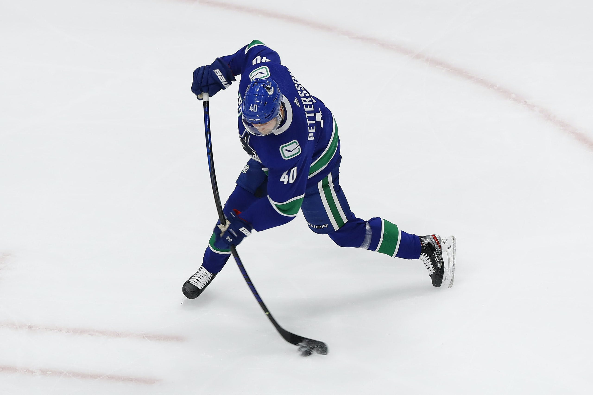

<div align="center">

#  NHL Game Prediction Project

 

</div>

## Project Introduction

This project will seek to build a model to effectively predict the outcome of National Hockey League games.

## Table of Contents

- [Motivation](#motivation)
- [Dataset](#dataset)
- [Roadmap](#roadmap)
- [Learnings](#learnings)

## Motivation

As an avid hockey fan, I have always been interested in the factors that are most important in determining the outcome of games. With the recent rise in statistical analysis of hockey players and games via Advanced Statistics, we have access to more useful data than ever. Nevertheless, the randomness and fluidity of hockey makes it notoriously difficult to accurately predict outcomes, with [62% accuracy](https://www.google.com/url?sa=t&rct=j&q=&esrc=s&source=web&cd=&cad=rja&uact=8&ved=2ahUKEwi39_L8vYOCAxVfODQIHcFnCJoQFnoECA4QAQ&url=https%3A%2F%2Fis.muni.cz%2Fth%2Froec4%2FAnalysis_of_NHL_games_Archive.pdf&usg=AOvVaw130WCcVDzGxZQHy_fbhI9c&opi=89978449) being [commonly held](https://www.researchgate.net/publication/284457066_Predicting_NHL_Match_Outcomes_with_ML_Models) as the upper limit of most models.

The purpose of this exercise is to test those limits, while gaining a deeper understanding of the variables that influence game outcomes. Success in this area would be of interest to general hockey fans, hockey journalists and content creators, and professional team management (general managers, coaches), not to mention the sports betting community!

## Dataset

Provide instructions and examples for use. Include screenshots as needed.

To add a screenshot, create an `assets/images` folder in your repository and upload your screenshot to it. Then, using the relative filepath, add it to your README using the following syntax:

    ```md
    
    ```

## Roadmap

### Data Cleaning


### Exploratory Data Analysis (EDA)


### Feature Engineering


### Modeling

List your collaborators, if any, with links to their GitHub profiles.

If you used any third-party assets that require attribution, list the creators with links to their primary web presence in this section.

If you followed tutorials, include links to those here as well.

## Learnings

The last section of a high-quality README file is the license. This lets other developers know what they can and cannot do with your project. If you need help choosing a license, refer to [https://choosealicense.com/](https://choosealicense.com/).

