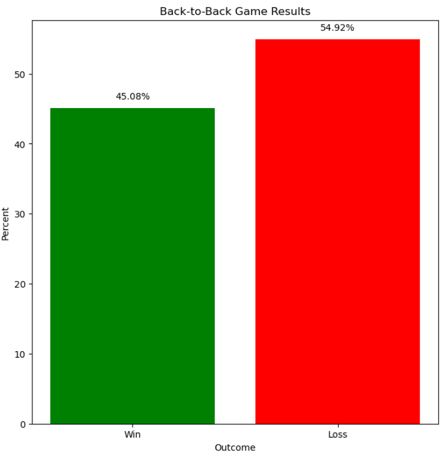
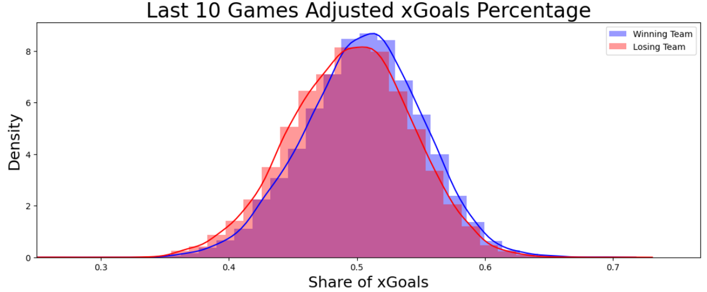

#  NHL Game Prediction Project

 

## Project Introduction

This project will seek to build a model to effectively predict the outcome of National Hockey League games.

## Table of Contents

- [Links to Analysis](#links-to-analysis)
- [Motivation](#motivation)
- [Dataset](#dataset)
- [Roadmap](#roadmap)
- [Learnings](#learnings)
- [Model Performance](#performance)
- [Next Steps](#next-steps)

## Links to Analysis

For anyone who wants to dive into the detailed analysis underlying this project, you can use the links below to quickly access the three main Jupyter Notebooks that contain all of the steps involved, including rationale and the Python code used to gather, clean, and extract insights from the data:

1. [Initial Date Upload and Exploratory Data Analysis](Notebooks/Initial_data_upload_and_EDA.ipynb)
2. [Preprocessing, EDA, and Basic Model Creation](Notebooks/Preprocessing_EDA_basic_model_creation.ipynb)
3. [Final Model Optimization, Evaluation, and Interpretation](Notebooks/Final%20Model%20Optimization,%20Evaluation%20and%20Interpretation.ipynb)

## Motivation

As an avid hockey fan, I have always been interested in the factors that are most important in determining the outcome of games. With the recent rise in statistical analysis of hockey players and games via Advanced Statistics, we have access to more useful data than ever. Nevertheless, the randomness and fluidity of hockey makes it notoriously difficult to accurately predict outcomes, with [62% accuracy](https://www.google.com/url?sa=t&rct=j&q=&esrc=s&source=web&cd=&cad=rja&uact=8&ved=2ahUKEwi39_L8vYOCAxVfODQIHcFnCJoQFnoECA4QAQ&url=https%3A%2F%2Fis.muni.cz%2Fth%2Froec4%2FAnalysis_of_NHL_games_Archive.pdf&usg=AOvVaw130WCcVDzGxZQHy_fbhI9c&opi=89978449) being [commonly held](https://www.researchgate.net/publication/284457066_Predicting_NHL_Match_Outcomes_with_ML_Models) as the upper limit of most models.

The purpose of this exercise is to test those limits, while gaining a deeper understanding of the variables that influence game outcomes. Success in this area would be of interest to general hockey fans, hockey journalists and content creators, and professional team management (general managers, coaches), not to mention the sports betting community!

## Dataset

I have sourced two datasets to provide the information that I want, and merged them into a single one for analysis. The first dataset comes from [Moneypuck.com](moneypuck.com). It contains ~190k rows of Advanced Stats for all NHL games from the 2008-09 season to the 2022-23 season, aggregated at a team level. The second dataset contains ~52k rows of basic statistics for each game from the 2000-01 season to the 2019-20 season, published by the NHL itself (although downloaded from Kaggle). 

I was tempted to exclude the second dataset, as the first dataset is more current and contains almost all of the same columns of data, albeit with different names. However, the first dataset does not have a column that states whether the team won or lost, which is the dependent variable I will be attempting to predict. I could conceivably subtract 'goals against' from 'goals for' in the first dataset, and create a binary variable for win or loss based on whether that calculation was positive or negative, but it turns out that the Moneypuck dataset, while at the team level, is the aggregation of individual player stats. This is really only problematic when determining the outcome of games decided in a shootout, as the the team that wins is credited with a winning goal, but no individual player is credited with a goal. Based on that, subtracting 'goals against' from 'goals for' in the Moneypuck dataset sometimes gives a result of 0, which would not allow me to determine the game winner from that dataset alone. As a result, I have included both datasets. I still hope to update all the data through the end of the 2022-23 season.

*Update:* I ultimately found the data I needed through the 2022-23 season in the NHL API. With much help from the internet, I figured out how to call the API and retrieve the data into a dataframe that I could then merge with my existing dataset. The data is now complete through 2022-23!

The initial data dictionary can be found [here](Notebooks/Data_Dictionary.ipynb). 

## Roadmap

### Data Merging
I started by merging the two datasets. Both included the game ID, but each game ID had two records, one for each team that played in that game. As a result, it was not a sufficient key on which to join the datasets. Both datasets had a form of team ID that could also be used, but one was in the form of a three-letter team abbreviation, while the other was a numerical team ID. Fortunately, the source of that data also provided an additional file with team information, including the three-letter abbreviation, so I had all the information I needed.

Or so I thought. I realized through several iterations that there were subtle differences between the team IDs. In one case, one used periods for names with initial while the other used three letters. For example, the New Jersey Devils were referred to as 'N.J' in one dataset, but 'NJD' in the other. Similarly, a couple of teams changed abbreviations during the seasons spanned, and the datasets treated the name changes differently. The Atlanta Thrashers (ATL) became the Winnipeg Jets (WPG) and the Phoenix Coyotes (PHX) became the Arizona Coyotes (ARI). One dataset included the changes while the other made the changes retroactive, meaning there were inconsistencies.

Despite the challenges, I was able to merge the two datasets, resulting in a single dataset with ~28k rows and 127 columns.

### Data Cleaning
Cleaning the merged dataset largely consisted of removing columns with duplicate information, along with the rows/seasons that the two datasets did not have in common. There were also some duplicate rows in one of the datasets, which appeared to be the result of human error in creating the dataset originally. I also chose to remove playoff games from the dataset, as it is a commonly-held belief that the regular season is not an accurate predictor of playoff outcome, and vice versa. Finally, I converted all of the important non-numeric columns to numeric, to enable me to run correlation analysis and regression, for example.

### Exploratory Data Analysis (EDA)
Initial EDA focused on overall average performance of teams along multiple dimensions, including wins and goals scored. I idenfied the variables with the highest positive and negative correlation with wins (not surprisingly, goals scored and goals allowed were at the top of each list). I also looked at some of the differences that were visible when filtering by the categories in the two major categorical variables: win/loss and home/away. For more information, see the [Learnings](#learnings) section below. 

### Feature Selection / Feature Engineering
I began this effort by creating some additional variables that I was interested in. I previously outlined this interest as follows:

- *Home teams win more frequently than visiting teams, but does that vary based on length of road trip (number of games) or distance traveled? I could potentially calculate the distance between cities where teams play and include that distance as a variable. Similarly, I could count the number of consecutive away games to see if there is any change in expected outcome depending on number of away games played in a row.*

I found a matrix showing the distance between all NHL cities, and used it to create a variable that calculate the distance traveled by team since the previous game. I ran a correlation between the variable and the likelihood of winning, and there was only a small negative relationship, i.e., as the distance traveled increased, there was a very slight downward impact on likelihood of winning. 

- *It is widely believed that when a team has to play games on back-to-back days, their chance of winning is decreased for the second game. I could calculate the number of days since the last game and analyze whether this is truly a factor.*

Using game dates, I created a variable calculating the number of days since the previous game for each team. I then created a second variable indicating whether the team played the day before the current game. That back-to-back variable showed a distinct impact on likelihood of winning. The winning percentage of teams playing on consecutive days drops to 45% (versus the baseline of 50% for all games).

- *There are some cases where I would most likely want to calculate a derived value rather than using the values that are in the dataset. For example, I have data on powerplay opportunities and powerplay goals, but I would like those consolidated into a single powerplay percentage value. The same holds for saves vs. goals against, i.e., save percentage. There may be other similar metrics that I want to derive, so I will need to plan for that.*

I created several such variables, including powerplay percentage, penalty kill percentage, save percentage, shooting percentage, and faceoff win percentage.

In addition to the above, I created several more derived features that converted raw data into comparative variables, e.g., share of shots in a game, takeaways: giveaways ratio.

### Baseline Modeling
After feature engineering, I had over 130 features. I chose ones with high correlation with wins, and low multicollinearity, and produced a first list of around 25 features for modeling.

I ran the selected set of variables through multiple classification models, and achieved the following initial accuracy results:

While the 95%+ accuracy looks impressive, it is important to remember that this modeling is predicting the outcome of games based on events happening during the games it is attempting to predict. This is not very valuable, other than to identify some of the key drivers of wins.

### Feature Engineering Revisited
In order to predict game outcomes, I need variables that I can know prior to a game, not just the majority of those in my dataset, which occur during the game. But I actually have a lot of such data -- I know the historical results of both teams. Based on that, I created new variables that compiled data from the prior 10 games into a single variable for each feature. 10 is an arbitrary number, I will look at other numbers, and I will also consider weighting more recent games higher than older ones. But before I do any of that, I need to understand if there is predictive value in this data? Is there a relationship between performance over the past 10 games and likelihood of winning the next game?

To evaluate that, I looked at the distribution of the new variables for the team that won the current game as compared to the losing team. Below are some of those comparisons.

The team that won the game outperformed the team that lost over the 10 game period prior to the game, meaning that we can draw conclusions for a single game based on those historical records.

Based on this, I ran the entire set of variables that include information available prior to a game though the same classification models as before, and got the following results:

With no feature optimization and no model tuning, we have achieved test accuracy of up to 58%. Ignore the horrendous overfitting on a few of the models, as I said, this is just a dump of 100+ variables. But the logistic regression in particular looks okay. 58% may not sound great, but it’s higher than the 54% we could get from picking the home team, and it’s starting to approach the best-performing publicly-available models, which tend to be in the low 60% accuracy range. So that’s promising.

### Final Feature Engineering
In the previous exercise, I concluded that I needed to build variables that aggregate past performance so that I can have inputs to a model to predict future performance. While the entire dataset included past performance data, that data was specific to the game in which it occurred. With that, I could build a very accurate model to determine the winner of a game, but only if I had the statistics from that particular game. This is not useful for predicting future outcomes.

To address this, I built variables that combined the data from the prior 10 games into single pregame variables for each feature. I determined that performance over the past 10 games can be used to predict future results, but the 10 game rolling window was arbitrary, and I wanted to see if other windows would perform better. I started building models that looked at the whole season. I ended up building weighted season-to-date variables, using a linear decay model. Here is a visual representation of what that weighting would look like over an 82-game season:

Here's a visualization of how that would apply to actual data. Specifically, this graph shows the actual goals scored by the Vancouver Canucks in the 2022-23 season, and adds a line displaying the rolling 10-game average and the weighted season-to-date average:

## Learnings
This section will be updated as the project progresses, but here are some initial findings from EDA.
#### Home-ice Advantage

The home team wins over 54% of the time. Given that the upper limit of the most successful prediction models is ~62%, there is a narrow window for achieving success of this project!

#### Goals

On average, teams score 2.78 goals, with goals totals fairly normally distributed.

Winning teams score 3.75 goals on average, versus 1.80 for losing teams. The average margin of victory is close to two goals.

#### Initial Correlation with Wins

Not surprisingly, goals scored appears to be the biggest driver of wins. Subsets of goals scored also appear on the list. Perhaps more interestingly, xGoals (Expected Goals) appears frequently on the list. xGoals is an advanced stat calculated based on a formula looking at the scoring chances that teams get in a game. In particular, the xGoalsPercentage, which is a ratio of xGoals to opposing team xGoals is high on the list. These are primarily offensive stats, with defensive stats not being as correlated with wins.

Again not surprisingly, goals against is the highest driver of losses. Many of these are mirror images of the entries in the positive correlation graph, applying the same stats to the opposing team, but there are some differences. For instance, lowDangerShotsFor is an offensive category for the team we are analyzing for their likelihood of winning. It appears that if a team takes a lot of shots, but they are low danger shots, it actually decreases their chances of winning.

#### Updated Correlation with Wins
Below are the newly-engineered variables with the highest positive and negative correlations with wins.

These correlations are much lower than our first list, where the highest correlation was ~0.6 (versus ~0.1). However, this data is available prior to a game, making it useful for predictions. How useful? Well, I ran the whole set of new variables through the models again, and got the following results:

With no feature optimization and no model tuning, we have achieved test accuracy of up to 58%. Ignore the horrendous overfitting on a few of the models, this is just a dump of 100+ variables. But the logistic regression in particular looks okay. 58% may not sound great, but it’s higher than the 54% we could get from picking the home team, and it’s starting to approach the best-performing publicly-available models, which tend to be in the low 60% accuracy range. So that’s promising.

## Performance

I evaluated the models' peformance on accuracy and log loss. The industry standard for evaluating performance of sports prediction models is not actually accuracy; instead, most are evaluated based on log loss, a measure of how close the prediction probabilities are to the actual value. The lower the value, the closer the predictions are to the actual value ([Source](https://www.dratings.com/explaining-log-loss/)). Here is an example of the performance of tracked NHL models, evaluated based on log loss:

The table below displays the best-performing model for each classifier.

Model performance was very consistent across the different classifiers. This suggests that we are pretty much at the upper limit of accuracy with the variables that we have. The lowest log loss of any of the models (0.6691) is in line with some of the published models I reviewed, so my results were respectable.

An additional, perhaps more accurate means to evaluate model performance is the return on investment one would receive by betting on the predctions that it generated. I sourced the historical moneyline odds for most of the games in my dataset, and used the predicted probabilities from my best-performing model (logistic regression) to simulate placing bets on my test set, then calculated the ROI. 

My first betting strategy was to bet $100 on the team the model believes has the higher likelihood of winning each game. While this intuitively makes sense, it is something of a "dumb" strategy, because it does not take into account the odds, and how they relate to my predicted probabilities.

To determine profitability, per bet profits are calculated based on the historical moneyline for each game, and combined into an overall profit. This strategy turned out to be profitable, returning $2,461. Of course, I had to bet $100 per game to make that profit, meaning a total investment of $228,000, for an ROI of ~1.1%. The graph below shows the cumulative profit over the course of the 2,280 games.

If the above betting strategy is "dumb", I felt sure I could come up with a smarter one. Since my model generates a specific probability of each team winning the game, rather than simply a binary favorite/underdog, I could use that to refine the betting strategy. If instead of betting on the team the model believes will win, I compared the model's predicted probabilities to the moneyling implied probabilities, and bet on the team where the predicted probability exceeds the implied probability. This strategy leverages the fact that payouts are based on the implied probabilities, so if the model believes a team has a higher probability than the implied, betting on that team should result in a higher expected value. In some cases, this strategy would mean not betting on either team, as the commission/profit built into the moneyline could push both teams' implied probabilities higher than the model's predicted probabilities.

Unfortunately, this strategy proved unsuccessful. Instead of betting on all 2,280 games, I only bet on 1,799 games, so my investment was ~$48k less than the above strategy, but I actually lost $2,683, for an ROI of -1.5%. The graph below shows that this strategy was a loser almost from the very start. At one point it was down more than $10k, because clawing back most of those losses.

The fundamental problem with this strategy is that it makes many bets that the model believes I will lose. While I could hope for the expected value of the bets to compensate for that, it is only likely to do so when the predictecd probabilities for both teams are fairly close. If the implied odds suggest that the underdog has only a 25% likelihood of winning the game, but my model believes they have a 27% likelihood, this strategy bets on them, even though I have little expectation that they will actually win. However if my model predicts that the underdog has a 49% chance of winning, I would not be surprised if they won the game. Unfortunately, these are the exact type of games that I wouldn't bet on at all. The odds build in the commission, so a game that the bookmaker believed had a 52%/48% favorite/underdog likelihood would actually have a calculated probability from the odds of something more like 54%/50%. Casinos do not like to offer even money on a coin flip, so they build in their profit! As a result, I skipped betting on those, instead betting on bigger underdogs who, not surprisingly, lost more frequently.

My final betting strategy combined these two strategies, betting on teams that the model predicted would win, but only if the predicted probability exceeded the implied probability. This strategy bet on far fewer games, requiring an outlay of only ~$89k. It ended up returning $4,531, for an ROI of 5.1%. It required a lot of patience, though; it was mostly unprofitable through the first 1,000 games!

#### Next Steps
While there remain model optimization opportunities, this exercise has demonstrated that there is the possibility of predicting NHL game outcomes with some degree of accuracy. While ~60% accuracy does not feel impressive, hockey is likely the most unpredictable of the major sports. The fact that strategic betting using the predicted outcomes from my model could potentially generate an ROI of 5% is very impressive. In fact, if I could replicate that consistently, there is likely a business model that such returns could support.

At a high level, such a business could include the standard details of a typical betting site, augmented with my model's  predictions, and recommendations of when to bet. It could link to the user's preferred betting site(s), earning affiliate revenue for each transaction. And if the model continues to prove successful, I could likely also charge a subscription fee for access, meaning there would be multiple possible revenue streams.

Introducing **PuckPredictor**TM !

# Additional Steps
- Consider model enhancements, including
    - Variables specific to special teams play
    - Additional score/venue adjusted stats
    - Enhanced goalie stats
    - Use individual player stats to build a bottom-up model
- Consider building a website to publish game predictions